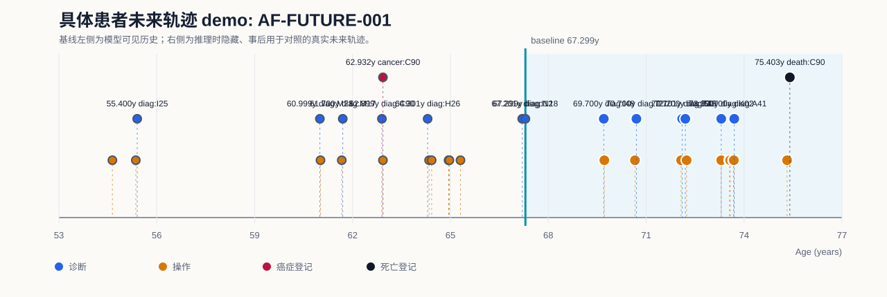
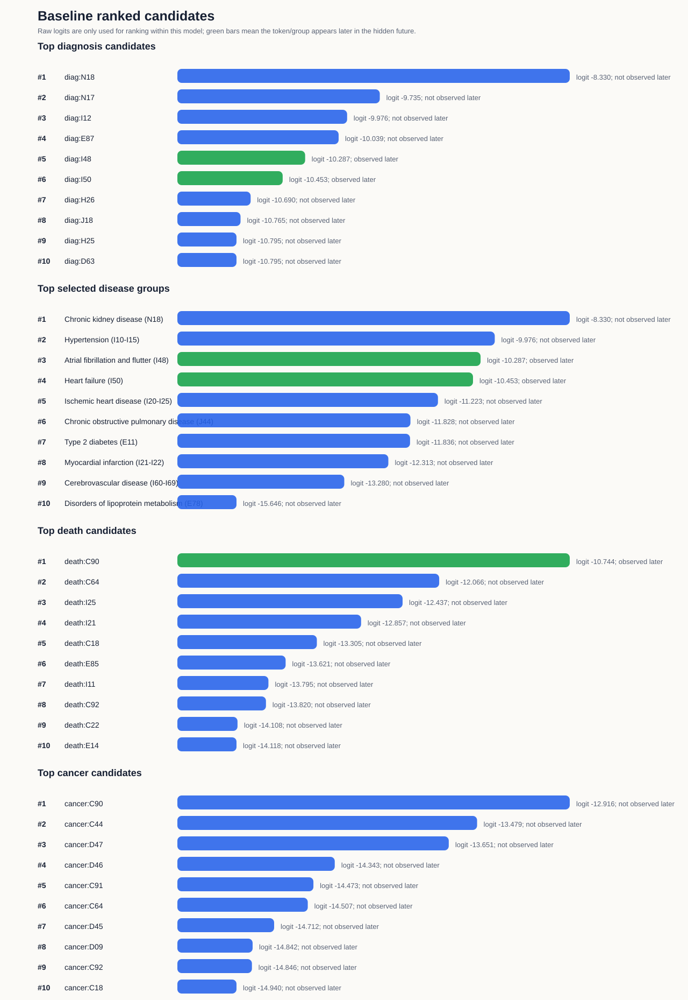
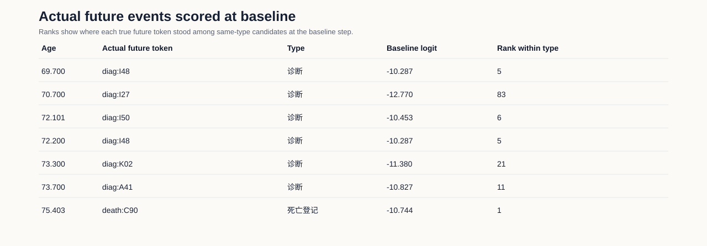

# 具体患者未来轨迹 Demo: AF-FUTURE-001

## Demo

该 demo 使用预训练的Delphi模型，在一个具体测试集患者的基线时点隐藏其后续事件，并把模型在baseline事件后给出的 ranked token 与真实未来轨迹对照。

当前模型是序列 next-token 模型；这里展示的是基线时点的一步候选排序与后续真实轨迹的对应关系，不是固定 5 年绝对风险预测。

## 病例概览

| 项目                  | 内容                                           |
| ------------------- | -------------------------------------------- |
| 模型                  | Exp2                                         |
| 数据 split            | test                                         |
| split_patient_index | 2028                                         |
| 患者 ID               | 已脱敏，不在汇报材料中展示                                |
| 基线年龄                | 67.299 岁                                     |
| 首个隐藏真实事件            | `diag:I48` at 69.700 岁                       |
| 目标展示疾病              | Atrial fibrillation and flutter, 房颤/房扑 (I48) |
| 首次房颤是否诊断 Top-5 命中   | 是                                            |
| baseline后随访长度       | 8.104 年                                      |
| baseline后死亡信息       | death:C90                                    |
| baseline后癌症信息       | baseline后未观察到癌症登记                            |

## 可视化

## Baseline前模型可见历史

| 年龄     | token        | 类型    |
| ------:| ------------ | ----- |
| 54.639 | `proc:X998`  | 手术/操作 |
| 55.357 | `proc:K633`  | 手术/操作 |
| 55.400 | `diag:I25`   | 诊断    |
| 60.999 | `diag:M23`   | 诊断    |
| 61.018 | `proc:W822`  | 手术/操作 |
| 61.670 | `proc:W401`  | 手术/操作 |
| 61.700 | `diag:M17`   | 诊断    |
| 62.899 | `diag:C90`   | 诊断    |
| 62.932 | `cancer:C90` | 癌症登记  |
| 62.932 | `proc:W365`  | 手术/操作 |
| 64.301 | `diag:H26`   | 诊断    |
| 64.345 | `proc:C751`  | 手术/操作 |
| 64.424 | `proc:K636`  | 手术/操作 |
| 64.947 | `proc:L916`  | 手术/操作 |
| 64.950 | `proc:X292`  | 手术/操作 |
| 64.969 | `proc:X352`  | 手术/操作 |
| 65.309 | `proc:X339`  | 手术/操作 |
| 67.201 | `diag:I12`   | 诊断    |
| 67.299 | `diag:N18`   | 诊断    |

## Baseline后隐藏真实轨迹

| 年龄     | token       | 类型    |
| ------:| ----------- | ----- |
| 69.700 | `diag:I48`  | 诊断    |
| 69.717 | `proc:X501` | 手术/操作 |
| 70.656 | `proc:K631` | 手术/操作 |
| 70.700 | `diag:I27`  | 诊断    |
| 72.071 | `proc:U201` | 手术/操作 |
| 72.101 | `diag:I50`  | 诊断    |
| 72.200 | `diag:I48`  | 诊断    |
| 72.241 | `proc:K623` | 手术/操作 |
| 73.300 | `diag:K02`  | 诊断    |
| 73.300 | `proc:F168` | 手术/操作 |
| 73.555 | `proc:X715` | 手术/操作 |
| 73.574 | `proc:X724` | 手术/操作 |
| 73.676 | `proc:X903` | 手术/操作 |
| 73.687 | `proc:S132` | 手术/操作 |
| 73.700 | `diag:A41`  | 诊断    |
| 75.318 | `proc:U051` | 手术/操作 |
| 75.403 | `death:C90` | 死亡登记  |

## 模型输出：诊断 token

| Rank | token      | raw logit | 后续是否出现 | 首次出现年龄 |
| ----:| ---------- | ---------:| ------ | ------:|
| 1    | `diag:N18` | -8.330    | 否      |        |
| 2    | `diag:N17` | -9.735    | 否      |        |
| 3    | `diag:I12` | -9.976    | 否      |        |
| 4    | `diag:E87` | -10.039   | 否      |        |
| 5    | `diag:I48` | -10.287   | 是      | 69.700 |
| 6    | `diag:I50` | -10.453   | 是      | 72.101 |
| 7    | `diag:H26` | -10.690   | 否      |        |
| 8    | `diag:J18` | -10.765   | 否      |        |
| 9    | `diag:H25` | -10.795   | 否      |        |
| 10   | `diag:D63` | -10.795   | 否      |        |

## 模型输出：有限疾病组

| Rank | 疾病组                                         | ICD-10    | 代表 token   | raw logit | 诊断内排名 | 后续是否出现 | 首次出现            |
| ----:| ------------------------------------------- | --------- | ---------- | ---------:| -----:| ------ | --------------- |
| 1    | Chronic kidney disease (N18)                | `N18`     | `diag:N18` | -8.330    | 1     | 否      |                 |
| 2    | Hypertension (I10-I15)                      | `I10-I15` | `diag:I12` | -9.976    | 3     | 否      |                 |
| 3    | Atrial fibrillation and flutter (I48)       | `I48`     | `diag:I48` | -10.287   | 5     | 是      | diag:I48 69.700 |
| 4    | Heart failure (I50)                         | `I50`     | `diag:I50` | -10.453   | 6     | 是      | diag:I50 72.101 |
| 5    | Ischemic heart disease (I20-I25)            | `I20-I25` | `diag:I25` | -11.223   | 18    | 否      |                 |
| 6    | Chronic obstructive pulmonary disease (J44) | `J44`     | `diag:J44` | -11.828   | 30    | 否      |                 |
| 7    | Type 2 diabetes (E11)                       | `E11`     | `diag:E11` | -11.836   | 32    | 否      |                 |
| 8    | Myocardial infarction (I21-I22)             | `I21-I22` | `diag:I21` | -12.313   | 53    | 否      |                 |
| 9    | Cerebrovascular disease (I60-I69)           | `I60-I69` | `diag:I63` | -13.280   | 117   | 否      |                 |
| 10   | Disorders of lipoprotein metabolism (E78)   | `E78`     | `diag:E78` | -15.646   | 345   | 否      |                 |

## 模型输出：死亡和癌症 token

| 类型  | Rank | token        | raw logit | 后续是否出现 | 首次出现年龄 |
| --- | ----:| ------------ | ---------:| ------ | ------:|
| 死亡  | 1    | `death:C90`  | -10.744   | 是      | 75.403 |
| 死亡  | 2    | `death:C64`  | -12.066   | 否      |        |
| 死亡  | 3    | `death:I25`  | -12.437   | 否      |        |
| 死亡  | 4    | `death:I21`  | -12.857   | 否      |        |
| 死亡  | 5    | `death:C18`  | -13.305   | 否      |        |
| 死亡  | 6    | `death:E85`  | -13.621   | 否      |        |
| 死亡  | 7    | `death:I11`  | -13.795   | 否      |        |
| 死亡  | 8    | `death:C92`  | -13.820   | 否      |        |
| 死亡  | 9    | `death:C22`  | -14.108   | 否      |        |
| 死亡  | 10   | `death:E14`  | -14.118   | 否      |        |
| 癌症  | 1    | `cancer:C90` | -12.916   | 否      |        |
| 癌症  | 2    | `cancer:C44` | -13.479   | 否      |        |
| 癌症  | 3    | `cancer:D47` | -13.651   | 否      |        |
| 癌症  | 4    | `cancer:D46` | -14.343   | 否      |        |
| 癌症  | 5    | `cancer:C91` | -14.473   | 否      |        |
| 癌症  | 6    | `cancer:C64` | -14.507   | 否      |        |
| 癌症  | 7    | `cancer:D45` | -14.712   | 否      |        |
| 癌症  | 8    | `cancer:D09` | -14.842   | 否      |        |
| 癌症  | 9    | `cancer:C92` | -14.846   | 否      |        |
| 癌症  | 10   | `cancer:C18` | -14.940   | 否      |        |

## 真实未来事件在baseline时间点时的得分

| 年龄     | 真实 token    | 类型   | baseline raw logit | 同类型候选内排名 |
| ------:| ----------- | ---- | ------------------:| --------:|
| 69.700 | `diag:I48`  | 诊断   | -10.287            | 5        |
| 70.700 | `diag:I27`  | 诊断   | -12.770            | 83       |
| 72.101 | `diag:I50`  | 诊断   | -10.453            | 6        |
| 72.200 | `diag:I48`  | 诊断   | -10.287            | 5        |
| 73.300 | `diag:K02`  | 诊断   | -11.380            | 21       |
| 73.700 | `diag:A41`  | 诊断   | -10.827            | 11       |
| 75.403 | `death:C90` | 死亡登记 | -10.744            | 1        |

## 总结

在 67.299 岁baseline时间，模型只能看到此前病史；真实未来首个隐藏事件为 `diag:I48`。模型对该目标 token 的诊断内排名为 5，因此这是一个 Top-5 命中的房颤展示病例。

该患者baseline之后真实轨迹还出现了 `diag:A41`, `diag:I27`, `diag:I48`, `diag:I50`, `diag:K02`，并最终记录 death:C90。

该 demo 可以展示具体患者层面的“模型候选排序”和“真实未来疾病/死亡轨迹”对照。
