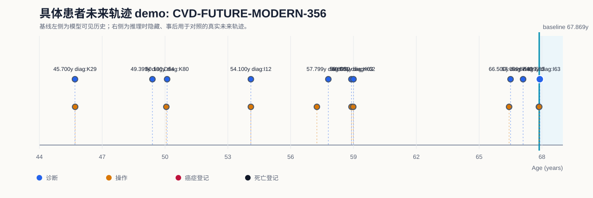
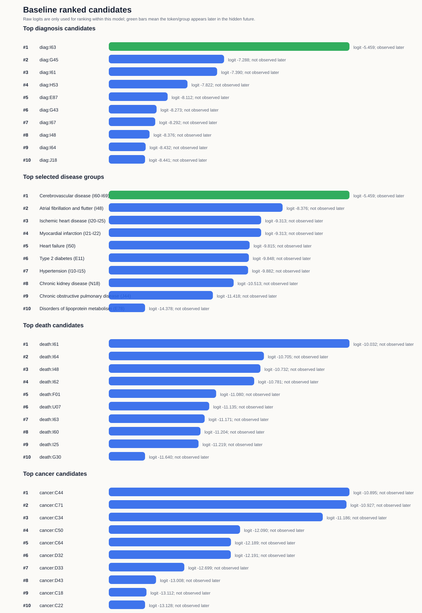

# 具体患者未来轨迹 Demo: CVD-FUTURE-MODERN-356

## Demo 定位

该 demo 使用训练好的 Exp2 多事件模型，在一个具体测试集患者的基线时点隐藏其后续事件，并把模型在基线时点给出的 ranked token 与真实未来轨迹对照。

注意：当前模型是序列 next-token 模型；这里展示的是基线时点的一步候选排序与后续真实轨迹的对应关系，不是固定 5 年绝对风险预测。

## 病例概览

| 项目 | 内容 |
|---|---|
| 模型 | MedTrajectory modern baseline |
| 数据 split | test |
| split_patient_index | 356 |
| 患者 ID | 已脱敏，不在汇报材料中展示 |
| 基线年龄 | 67.869 岁 |
| 首个隐藏真实事件 | `diag:I63` at 67.899 岁 |
| 目标展示疾病 | Cerebrovascular disease (I60-I69) |
| 目标疾病首次事件是否诊断 Top-5 命中 | 是 |
| 基线后随访长度 | 0.030 年 |
| 基线后死亡信息 | 未观察到死亡登记 |
| 基线后癌症信息 | 基线后未观察到癌症登记 |

## 可视化

## 基线前模型可见历史

| 年龄 | token | 类型 |
|---:|---|---|
| 45.700 | `diag:K29` | 诊断 |
| 45.708 | `proc:G451` | 手术/操作 |
| 49.399 | `diag:D64` | 诊断 |
| 50.062 | `proc:J261` | 手术/操作 |
| 50.100 | `diag:K80` | 诊断 |
| 54.100 | `diag:I12` | 诊断 |
| 54.100 | `proc:X998` | 手术/操作 |
| 57.251 | `proc:T865` | 手术/操作 |
| 57.799 | `diag:D50` | 诊断 |
| 58.899 | `diag:K63` | 诊断 |
| 58.905 | `proc:H202` | 手术/操作 |
| 58.990 | `proc:H231` | 手术/操作 |
| 59.001 | `diag:K62` | 诊断 |
| 66.431 | `proc:C601` | 手术/操作 |
| 66.500 | `diag:H40` | 诊断 |
| 67.099 | `diag:E83` | 诊断 |
| 67.855 | `proc:U051` | 手术/操作 |
| 67.869 | `proc:U543` | 手术/操作 |

## 基线后隐藏真实轨迹

| 年龄 | token | 类型 |
|---:|---|---|
| 67.899 | `diag:I63` | 诊断 |

## 基线模型输出：诊断 token

| Rank | token | raw logit | 后续是否出现 | 首次出现年龄 |
|---:|---|---:|---|---:|
| 1 | `diag:I63` | -5.459 | 是 | 67.899 |
| 2 | `diag:G45` | -7.288 | 否 |  |
| 3 | `diag:I61` | -7.390 | 否 |  |
| 4 | `diag:H53` | -7.822 | 否 |  |
| 5 | `diag:E87` | -8.112 | 否 |  |
| 6 | `diag:G43` | -8.273 | 否 |  |
| 7 | `diag:I67` | -8.292 | 否 |  |
| 8 | `diag:I48` | -8.376 | 否 |  |
| 9 | `diag:I64` | -8.432 | 否 |  |
| 10 | `diag:J18` | -8.441 | 否 |  |

## 基线模型输出：有限疾病组

| Rank | 疾病组 | ICD-10 | 代表 token | raw logit | 诊断内排名 | 后续是否出现 | 首次出现 |
|---:|---|---|---|---:|---:|---|---|
| 1 | Cerebrovascular disease (I60-I69) | `I60-I69` | `diag:I63` | -5.459 | 1 | 是 | diag:I63 67.899 |
| 2 | Atrial fibrillation and flutter (I48) | `I48` | `diag:I48` | -8.376 | 8 | 否 |   |
| 3 | Ischemic heart disease (I20-I25) | `I20-I25` | `diag:I21` | -9.313 | 21 | 否 |   |
| 4 | Myocardial infarction (I21-I22) | `I21-I22` | `diag:I21` | -9.313 | 21 | 否 |   |
| 5 | Heart failure (I50) | `I50` | `diag:I50` | -9.815 | 33 | 否 |   |
| 6 | Type 2 diabetes (E11) | `E11` | `diag:E11` | -9.848 | 35 | 否 |   |
| 7 | Hypertension (I10-I15) | `I10-I15` | `diag:I10` | -9.882 | 37 | 否 |   |
| 8 | Chronic kidney disease (N18) | `N18` | `diag:N18` | -10.513 | 55 | 否 |   |
| 9 | Chronic obstructive pulmonary disease (J44) | `J44` | `diag:J44` | -11.418 | 112 | 否 |   |
| 10 | Disorders of lipoprotein metabolism (E78) | `E78` | `diag:E78` | -14.378 | 433 | 否 |   |

## 基线模型输出：死亡和癌症 token

| 类型 | Rank | token | raw logit | 后续是否出现 | 首次出现年龄 |
|---|---:|---|---:|---|---:|
| 死亡 | 1 | `death:I61` | -10.032 | 否 |  |
| 死亡 | 2 | `death:I64` | -10.705 | 否 |  |
| 死亡 | 3 | `death:I48` | -10.732 | 否 |  |
| 死亡 | 4 | `death:I62` | -10.781 | 否 |  |
| 死亡 | 5 | `death:F01` | -11.080 | 否 |  |
| 死亡 | 6 | `death:U07` | -11.135 | 否 |  |
| 死亡 | 7 | `death:I63` | -11.171 | 否 |  |
| 死亡 | 8 | `death:I60` | -11.204 | 否 |  |
| 死亡 | 9 | `death:I25` | -11.219 | 否 |  |
| 死亡 | 10 | `death:G30` | -11.640 | 否 |  |
| 癌症 | 1 | `cancer:C44` | -10.895 | 否 |  |
| 癌症 | 2 | `cancer:C71` | -10.927 | 否 |  |
| 癌症 | 3 | `cancer:C34` | -11.186 | 否 |  |
| 癌症 | 4 | `cancer:C50` | -12.090 | 否 |  |
| 癌症 | 5 | `cancer:C64` | -12.189 | 否 |  |
| 癌症 | 6 | `cancer:D32` | -12.191 | 否 |  |
| 癌症 | 7 | `cancer:D33` | -12.699 | 否 |  |
| 癌症 | 8 | `cancer:D43` | -13.008 | 否 |  |
| 癌症 | 9 | `cancer:C18` | -13.112 | 否 |  |
| 癌症 | 10 | `cancer:C22` | -13.128 | 否 |  |

## 真实未来事件在基线时的得分

| 年龄 | 真实 token | 类型 | baseline raw logit | 同类型候选内排名 |
|---:|---|---|---:|---:|
| 67.899 | `diag:I63` | 诊断 | -5.459 | 1 |

## 汇报口径

在 67.869 岁基线时点，模型只能看到此前病史；真实未来首个隐藏事件为 `diag:I63`。模型对该目标 token 的诊断内排名为 1，因此这是一个 Top-5 命中的目标疾病展示病例。

该患者基线后真实轨迹还出现了 `diag:I63`，并最终记录 未观察到死亡登记。因此该 demo 可以展示具体患者层面的“模型候选排序”和“真实未来疾病/死亡轨迹”对照。
