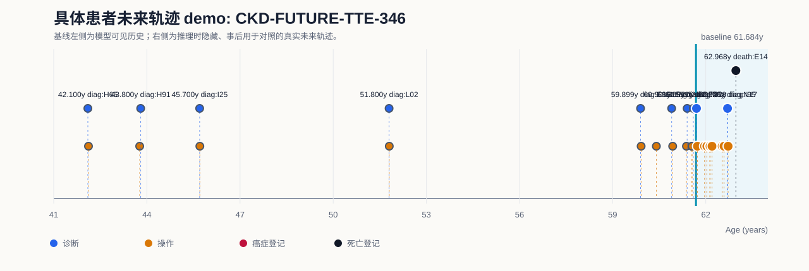
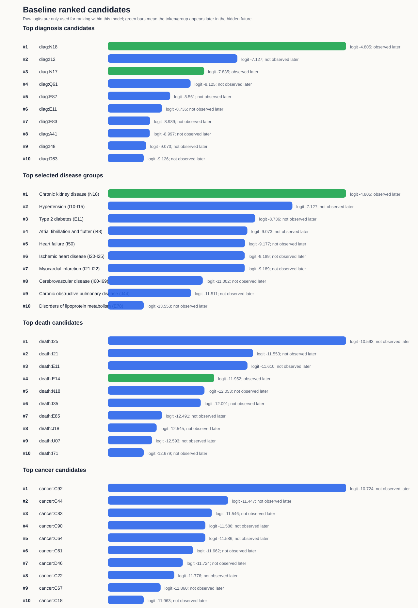
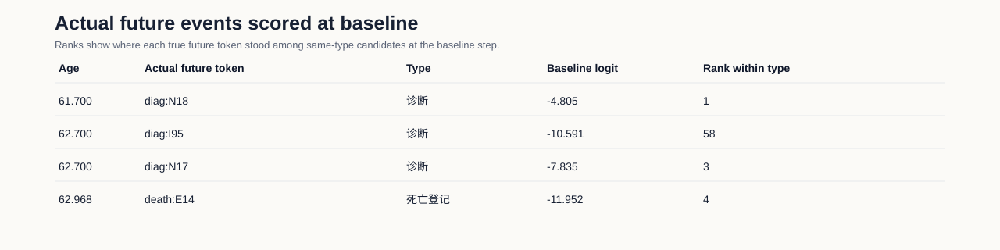

# 具体患者未来轨迹 Demo: CKD-FUTURE-TTE-346

## Demo 定位

该 demo 使用训练好的 Exp2 多事件模型，在一个具体测试集患者的基线时点隐藏其后续事件，并把模型在基线时点给出的 ranked token 与真实未来轨迹对照。

注意：当前模型是序列 next-token 模型；这里展示的是基线时点的一步候选排序与后续真实轨迹的对应关系，不是固定 5 年绝对风险预测。

## 病例概览

| 项目 | 内容 |
|---|---|
| 模型 | MedTrajectory TTE multitask |
| 数据 split | test |
| split_patient_index | 346 |
| 患者 ID | 已脱敏，不在汇报材料中展示 |
| 基线年龄 | 61.684 岁 |
| 首个隐藏真实事件 | `diag:N18` at 61.700 岁 |
| 目标展示疾病 | Chronic kidney disease (N18) |
| 目标疾病首次事件是否诊断 Top-5 命中 | 是 |
| 基线后随访长度 | 1.284 年 |
| 基线后死亡信息 | death:E14 |
| 基线后癌症信息 | 基线后未观察到癌症登记 |

## 可视化

## 基线前模型可见历史

| 年龄 | token | 类型 |
|---:|---|---|
| 42.100 | `diag:H65` | 诊断 |
| 42.119 | `proc:E253` | 手术/操作 |
| 43.767 | `proc:D151` | 手术/操作 |
| 43.800 | `diag:H91` | 诊断 |
| 45.700 | `diag:I25` | 诊断 |
| 45.706 | `proc:K633` | 手术/操作 |
| 51.800 | `diag:L02` | 诊断 |
| 51.806 | `proc:S472` | 手术/操作 |
| 59.899 | `diag:E86` | 诊断 |
| 59.918 | `proc:X998` | 手术/操作 |
| 60.408 | `proc:H229` | 手术/操作 |
| 60.901 | `diag:I21` | 诊断 |
| 60.934 | `proc:K752` | 手术/操作 |
| 61.377 | `proc:W365` | 手术/操作 |
| 61.399 | `diag:D50` | 诊断 |
| 61.552 | `proc:X403` | 手术/操作 |
| 61.561 | `proc:K491` | 手术/操作 |
| 61.599 | `diag:I25` | 诊断 |
| 61.684 | `proc:X411` | 手术/操作 |

## 基线后隐藏真实轨迹

| 年龄 | token | 类型 |
|---:|---|---|
| 61.700 | `diag:N18` | 诊断 |
| 61.730 | `proc:X412` | 手术/操作 |
| 61.958 | `proc:L932` | 手术/操作 |
| 62.034 | `proc:L742` | 手术/操作 |
| 62.130 | `proc:L747` | 手术/操作 |
| 62.136 | `proc:L743` | 手术/操作 |
| 62.201 | `proc:K634` | 手术/操作 |
| 62.527 | `proc:E852` | 手术/操作 |
| 62.587 | `proc:E851` | 手术/操作 |
| 62.700 | `diag:I95` | 诊断 |
| 62.700 | `diag:N17` | 诊断 |
| 62.719 | `proc:L912` | 手术/操作 |
| 62.968 | `death:E14` | 死亡登记 |

## 基线模型输出：诊断 token

| Rank | token | raw logit | 后续是否出现 | 首次出现年龄 |
|---:|---|---:|---|---:|
| 1 | `diag:N18` | -4.805 | 是 | 61.700 |
| 2 | `diag:I12` | -7.127 | 否 |  |
| 3 | `diag:N17` | -7.835 | 是 | 62.700 |
| 4 | `diag:Q61` | -8.125 | 否 |  |
| 5 | `diag:E87` | -8.561 | 否 |  |
| 6 | `diag:E11` | -8.736 | 否 |  |
| 7 | `diag:E83` | -8.989 | 否 |  |
| 8 | `diag:A41` | -8.997 | 否 |  |
| 9 | `diag:I48` | -9.073 | 否 |  |
| 10 | `diag:D63` | -9.126 | 否 |  |

## 基线模型输出：有限疾病组

| Rank | 疾病组 | ICD-10 | 代表 token | raw logit | 诊断内排名 | 后续是否出现 | 首次出现 |
|---:|---|---|---|---:|---:|---|---|
| 1 | Chronic kidney disease (N18) | `N18` | `diag:N18` | -4.805 | 1 | 是 | diag:N18 61.700 |
| 2 | Hypertension (I10-I15) | `I10-I15` | `diag:I12` | -7.127 | 2 | 否 |   |
| 3 | Type 2 diabetes (E11) | `E11` | `diag:E11` | -8.736 | 6 | 否 |   |
| 4 | Atrial fibrillation and flutter (I48) | `I48` | `diag:I48` | -9.073 | 9 | 否 |   |
| 5 | Heart failure (I50) | `I50` | `diag:I50` | -9.177 | 11 | 否 |   |
| 6 | Ischemic heart disease (I20-I25) | `I20-I25` | `diag:I21` | -9.189 | 12 | 否 |   |
| 7 | Myocardial infarction (I21-I22) | `I21-I22` | `diag:I21` | -9.189 | 12 | 否 |   |
| 8 | Cerebrovascular disease (I60-I69) | `I60-I69` | `diag:I63` | -11.002 | 67 | 否 |   |
| 9 | Chronic obstructive pulmonary disease (J44) | `J44` | `diag:J44` | -11.511 | 104 | 否 |   |
| 10 | Disorders of lipoprotein metabolism (E78) | `E78` | `diag:E78` | -13.553 | 341 | 否 |   |

## 基线模型输出：死亡和癌症 token

| 类型 | Rank | token | raw logit | 后续是否出现 | 首次出现年龄 |
|---|---:|---|---:|---|---:|
| 死亡 | 1 | `death:I25` | -10.593 | 否 |  |
| 死亡 | 2 | `death:I21` | -11.553 | 否 |  |
| 死亡 | 3 | `death:E11` | -11.610 | 否 |  |
| 死亡 | 4 | `death:E14` | -11.952 | 是 | 62.968 |
| 死亡 | 5 | `death:N18` | -12.053 | 否 |  |
| 死亡 | 6 | `death:I35` | -12.091 | 否 |  |
| 死亡 | 7 | `death:E85` | -12.491 | 否 |  |
| 死亡 | 8 | `death:J18` | -12.545 | 否 |  |
| 死亡 | 9 | `death:U07` | -12.593 | 否 |  |
| 死亡 | 10 | `death:I71` | -12.679 | 否 |  |
| 癌症 | 1 | `cancer:C92` | -10.724 | 否 |  |
| 癌症 | 2 | `cancer:C44` | -11.447 | 否 |  |
| 癌症 | 3 | `cancer:C83` | -11.546 | 否 |  |
| 癌症 | 4 | `cancer:C90` | -11.586 | 否 |  |
| 癌症 | 5 | `cancer:C64` | -11.586 | 否 |  |
| 癌症 | 6 | `cancer:C61` | -11.662 | 否 |  |
| 癌症 | 7 | `cancer:D46` | -11.724 | 否 |  |
| 癌症 | 8 | `cancer:C22` | -11.776 | 否 |  |
| 癌症 | 9 | `cancer:C67` | -11.860 | 否 |  |
| 癌症 | 10 | `cancer:C18` | -11.963 | 否 |  |

## 真实未来事件在基线时的得分

| 年龄 | 真实 token | 类型 | baseline raw logit | 同类型候选内排名 |
|---:|---|---|---:|---:|
| 61.700 | `diag:N18` | 诊断 | -4.805 | 1 |
| 62.700 | `diag:I95` | 诊断 | -10.591 | 58 |
| 62.700 | `diag:N17` | 诊断 | -7.835 | 3 |
| 62.968 | `death:E14` | 死亡登记 | -11.952 | 4 |

## 汇报口径

在 61.684 岁基线时点，模型只能看到此前病史；真实未来首个隐藏事件为 `diag:N18`。模型对该目标 token 的诊断内排名为 1，因此这是一个 Top-5 命中的目标疾病展示病例。

该患者基线后真实轨迹还出现了 `diag:I95`, `diag:N17`, `diag:N18`，并最终记录 death:E14。因此该 demo 可以展示具体患者层面的“模型候选排序”和“真实未来疾病/死亡轨迹”对照。
