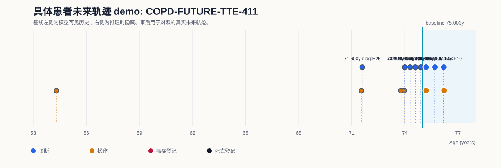
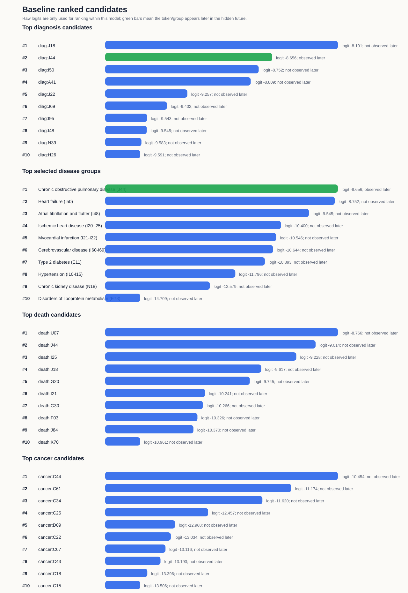
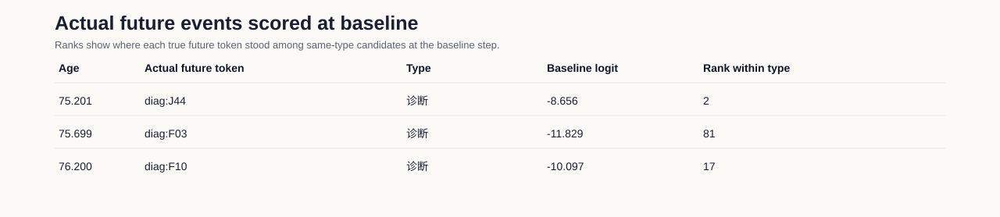

# 具体患者未来轨迹 Demo: COPD-FUTURE-TTE-411

## Demo 定位

该 demo 使用训练好的 Exp2 多事件模型，在一个具体测试集患者的基线时点隐藏其后续事件，并把模型在基线时点给出的 ranked token 与真实未来轨迹对照。

注意：当前模型是序列 next-token 模型；这里展示的是基线时点的一步候选排序与后续真实轨迹的对应关系，不是固定 5 年绝对风险预测。

## 病例概览

| 项目 | 内容 |
|---|---|
| 模型 | MedTrajectory TTE multitask |
| 数据 split | test |
| split_patient_index | 411 |
| 患者 ID | 已脱敏，不在汇报材料中展示 |
| 基线年龄 | 75.003 岁 |
| 首个隐藏真实事件 | `diag:J44` at 75.201 岁 |
| 目标展示疾病 | Chronic obstructive pulmonary disease (J44) |
| 目标疾病首次事件是否诊断 Top-5 命中 | 是 |
| 基线后随访长度 | 1.211 年 |
| 基线后死亡信息 | 未观察到死亡登记 |
| 基线后癌症信息 | 基线后未观察到癌症登记 |

## 可视化

## 基线前模型可见历史

| 年龄 | token | 类型 |
|---:|---|---|
| 54.311 | `proc:S069` | 手术/操作 |
| 71.546 | `proc:C751` | 手术/操作 |
| 71.600 | `diag:H25` | 诊断 |
| 73.788 | `proc:X998` | 手术/操作 |
| 73.966 | `proc:E852` | 手术/操作 |
| 73.966 | `proc:U201` | 手术/操作 |
| 73.999 | `diag:I47` | 诊断 |
| 73.999 | `diag:J96` | 诊断 |
| 74.300 | `diag:K85` | 诊断 |
| 74.601 | `diag:M54` | 诊断 |
| 74.899 | `diag:J22` | 诊断 |

## 基线后隐藏真实轨迹

| 年龄 | token | 类型 |
|---:|---|---|
| 75.201 | `diag:J44` | 诊断 |
| 75.201 | `proc:U071` | 手术/操作 |
| 75.699 | `diag:F03` | 诊断 |
| 76.200 | `diag:F10` | 诊断 |
| 76.214 | `proc:U198` | 手术/操作 |

## 基线模型输出：诊断 token

| Rank | token | raw logit | 后续是否出现 | 首次出现年龄 |
|---:|---|---:|---|---:|
| 1 | `diag:J18` | -8.191 | 否 |  |
| 2 | `diag:J44` | -8.656 | 是 | 75.201 |
| 3 | `diag:I50` | -8.752 | 否 |  |
| 4 | `diag:A41` | -8.809 | 否 |  |
| 5 | `diag:J22` | -9.257 | 否 |  |
| 6 | `diag:J69` | -9.402 | 否 |  |
| 7 | `diag:I95` | -9.543 | 否 |  |
| 8 | `diag:I48` | -9.545 | 否 |  |
| 9 | `diag:N39` | -9.583 | 否 |  |
| 10 | `diag:H26` | -9.591 | 否 |  |

## 基线模型输出：有限疾病组

| Rank | 疾病组 | ICD-10 | 代表 token | raw logit | 诊断内排名 | 后续是否出现 | 首次出现 |
|---:|---|---|---|---:|---:|---|---|
| 1 | Chronic obstructive pulmonary disease (J44) | `J44` | `diag:J44` | -8.656 | 2 | 是 | diag:J44 75.201 |
| 2 | Heart failure (I50) | `I50` | `diag:I50` | -8.752 | 3 | 否 |   |
| 3 | Atrial fibrillation and flutter (I48) | `I48` | `diag:I48` | -9.545 | 8 | 否 |   |
| 4 | Ischemic heart disease (I20-I25) | `I20-I25` | `diag:I25` | -10.400 | 21 | 否 |   |
| 5 | Myocardial infarction (I21-I22) | `I21-I22` | `diag:I21` | -10.546 | 24 | 否 |   |
| 6 | Cerebrovascular disease (I60-I69) | `I60-I69` | `diag:I63` | -10.644 | 27 | 否 |   |
| 7 | Type 2 diabetes (E11) | `E11` | `diag:E11` | -10.893 | 38 | 否 |   |
| 8 | Hypertension (I10-I15) | `I10-I15` | `diag:I10` | -11.796 | 77 | 否 |   |
| 9 | Chronic kidney disease (N18) | `N18` | `diag:N18` | -12.579 | 136 | 否 |   |
| 10 | Disorders of lipoprotein metabolism (E78) | `E78` | `diag:E78` | -14.709 | 366 | 否 |   |

## 基线模型输出：死亡和癌症 token

| 类型 | Rank | token | raw logit | 后续是否出现 | 首次出现年龄 |
|---|---:|---|---:|---|---:|
| 死亡 | 1 | `death:U07` | -8.766 | 否 |  |
| 死亡 | 2 | `death:J44` | -9.014 | 否 |  |
| 死亡 | 3 | `death:I25` | -9.228 | 否 |  |
| 死亡 | 4 | `death:J18` | -9.617 | 否 |  |
| 死亡 | 5 | `death:G20` | -9.745 | 否 |  |
| 死亡 | 6 | `death:I21` | -10.241 | 否 |  |
| 死亡 | 7 | `death:G30` | -10.266 | 否 |  |
| 死亡 | 8 | `death:F03` | -10.326 | 否 |  |
| 死亡 | 9 | `death:J84` | -10.370 | 否 |  |
| 死亡 | 10 | `death:K70` | -10.961 | 否 |  |
| 癌症 | 1 | `cancer:C44` | -10.454 | 否 |  |
| 癌症 | 2 | `cancer:C61` | -11.174 | 否 |  |
| 癌症 | 3 | `cancer:C34` | -11.620 | 否 |  |
| 癌症 | 4 | `cancer:C25` | -12.457 | 否 |  |
| 癌症 | 5 | `cancer:D09` | -12.968 | 否 |  |
| 癌症 | 6 | `cancer:C22` | -13.034 | 否 |  |
| 癌症 | 7 | `cancer:C67` | -13.116 | 否 |  |
| 癌症 | 8 | `cancer:C43` | -13.193 | 否 |  |
| 癌症 | 9 | `cancer:C18` | -13.396 | 否 |  |
| 癌症 | 10 | `cancer:C15` | -13.506 | 否 |  |

## 真实未来事件在基线时的得分

| 年龄 | 真实 token | 类型 | baseline raw logit | 同类型候选内排名 |
|---:|---|---|---:|---:|
| 75.201 | `diag:J44` | 诊断 | -8.656 | 2 |
| 75.699 | `diag:F03` | 诊断 | -11.829 | 81 |
| 76.200 | `diag:F10` | 诊断 | -10.097 | 17 |

## 汇报口径

在 75.003 岁基线时点，模型只能看到此前病史；真实未来首个隐藏事件为 `diag:J44`。模型对该目标 token 的诊断内排名为 2，因此这是一个 Top-5 命中的目标疾病展示病例。

该患者基线后真实轨迹还出现了 `diag:F03`, `diag:F10`, `diag:J44`，并最终记录 未观察到死亡登记。因此该 demo 可以展示具体患者层面的“模型候选排序”和“真实未来疾病/死亡轨迹”对照。
