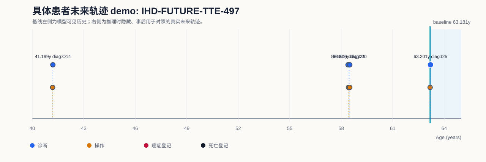
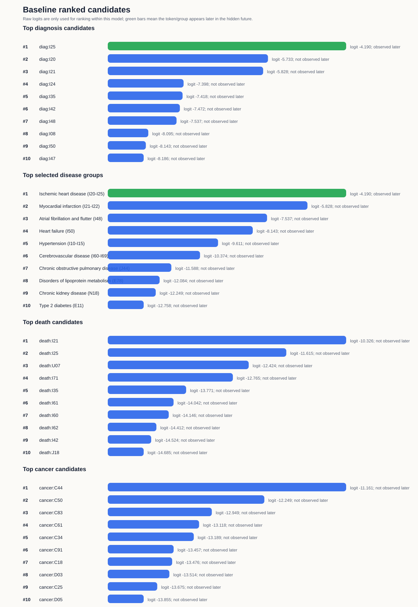
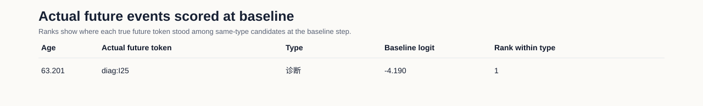

# 具体患者未来轨迹 Demo: IHD-FUTURE-TTE-497

## Demo 定位

该 demo 使用训练好的 Exp2 多事件模型，在一个具体测试集患者的基线时点隐藏其后续事件，并把模型在基线时点给出的 ranked token 与真实未来轨迹对照。

注意：当前模型是序列 next-token 模型；这里展示的是基线时点的一步候选排序与后续真实轨迹的对应关系，不是固定 5 年绝对风险预测。

## 病例概览

| 项目 | 内容 |
|---|---|
| 模型 | MedTrajectory TTE multitask |
| 数据 split | test |
| split_patient_index | 497 |
| 患者 ID | 已脱敏，不在汇报材料中展示 |
| 基线年龄 | 63.181 岁 |
| 首个隐藏真实事件 | `diag:I25` at 63.201 岁 |
| 目标展示疾病 | Ischemic heart disease (I20-I25) |
| 目标疾病首次事件是否诊断 Top-5 命中 | 是 |
| 基线后随访长度 | 0.019 年 |
| 基线后死亡信息 | 未观察到死亡登记 |
| 基线后癌症信息 | 基线后未观察到癌症登记 |

## 可视化

## 基线前模型可见历史

| 年龄 | token | 类型 |
|---:|---|---|
| 41.185 | `proc:R249` | 手术/操作 |
| 41.199 | `diag:O14` | 诊断 |
| 58.401 | `diag:I21` | 诊断 |
| 58.423 | `proc:K751` | 手术/操作 |
| 58.500 | `diag:I20` | 诊断 |
| 58.500 | `proc:X998` | 手术/操作 |
| 63.181 | `proc:K634` | 手术/操作 |

## 基线后隐藏真实轨迹

| 年龄 | token | 类型 |
|---:|---|---|
| 63.201 | `diag:I25` | 诊断 |

## 基线模型输出：诊断 token

| Rank | token | raw logit | 后续是否出现 | 首次出现年龄 |
|---:|---|---:|---|---:|
| 1 | `diag:I25` | -4.190 | 是 | 63.201 |
| 2 | `diag:I20` | -5.733 | 否 |  |
| 3 | `diag:I21` | -5.828 | 否 |  |
| 4 | `diag:I24` | -7.398 | 否 |  |
| 5 | `diag:I35` | -7.418 | 否 |  |
| 6 | `diag:I42` | -7.472 | 否 |  |
| 7 | `diag:I48` | -7.537 | 否 |  |
| 8 | `diag:I08` | -8.095 | 否 |  |
| 9 | `diag:I50` | -8.143 | 否 |  |
| 10 | `diag:I47` | -8.186 | 否 |  |

## 基线模型输出：有限疾病组

| Rank | 疾病组 | ICD-10 | 代表 token | raw logit | 诊断内排名 | 后续是否出现 | 首次出现 |
|---:|---|---|---|---:|---:|---|---|
| 1 | Ischemic heart disease (I20-I25) | `I20-I25` | `diag:I25` | -4.190 | 1 | 是 | diag:I25 63.201 |
| 2 | Myocardial infarction (I21-I22) | `I21-I22` | `diag:I21` | -5.828 | 3 | 否 |   |
| 3 | Atrial fibrillation and flutter (I48) | `I48` | `diag:I48` | -7.537 | 7 | 否 |   |
| 4 | Heart failure (I50) | `I50` | `diag:I50` | -8.143 | 9 | 否 |   |
| 5 | Hypertension (I10-I15) | `I10-I15` | `diag:I10` | -9.611 | 16 | 否 |   |
| 6 | Cerebrovascular disease (I60-I69) | `I60-I69` | `diag:I63` | -10.374 | 28 | 否 |   |
| 7 | Chronic obstructive pulmonary disease (J44) | `J44` | `diag:J44` | -11.588 | 68 | 否 |   |
| 8 | Disorders of lipoprotein metabolism (E78) | `E78` | `diag:E78` | -12.084 | 93 | 否 |   |
| 9 | Chronic kidney disease (N18) | `N18` | `diag:N18` | -12.249 | 107 | 否 |   |
| 10 | Type 2 diabetes (E11) | `E11` | `diag:E11` | -12.758 | 148 | 否 |   |

## 基线模型输出：死亡和癌症 token

| 类型 | Rank | token | raw logit | 后续是否出现 | 首次出现年龄 |
|---|---:|---|---:|---|---:|
| 死亡 | 1 | `death:I21` | -10.326 | 否 |  |
| 死亡 | 2 | `death:I25` | -11.615 | 否 |  |
| 死亡 | 3 | `death:U07` | -12.424 | 否 |  |
| 死亡 | 4 | `death:I71` | -12.765 | 否 |  |
| 死亡 | 5 | `death:I35` | -13.771 | 否 |  |
| 死亡 | 6 | `death:I61` | -14.042 | 否 |  |
| 死亡 | 7 | `death:I60` | -14.146 | 否 |  |
| 死亡 | 8 | `death:I62` | -14.412 | 否 |  |
| 死亡 | 9 | `death:I42` | -14.524 | 否 |  |
| 死亡 | 10 | `death:J18` | -14.685 | 否 |  |
| 癌症 | 1 | `cancer:C44` | -11.161 | 否 |  |
| 癌症 | 2 | `cancer:C50` | -12.249 | 否 |  |
| 癌症 | 3 | `cancer:C83` | -12.949 | 否 |  |
| 癌症 | 4 | `cancer:C61` | -13.118 | 否 |  |
| 癌症 | 5 | `cancer:C34` | -13.189 | 否 |  |
| 癌症 | 6 | `cancer:C91` | -13.457 | 否 |  |
| 癌症 | 7 | `cancer:C18` | -13.476 | 否 |  |
| 癌症 | 8 | `cancer:D03` | -13.514 | 否 |  |
| 癌症 | 9 | `cancer:C25` | -13.675 | 否 |  |
| 癌症 | 10 | `cancer:D05` | -13.855 | 否 |  |

## 真实未来事件在基线时的得分

| 年龄 | 真实 token | 类型 | baseline raw logit | 同类型候选内排名 |
|---:|---|---|---:|---:|
| 63.201 | `diag:I25` | 诊断 | -4.190 | 1 |

## 汇报口径

在 63.181 岁基线时点，模型只能看到此前病史；真实未来首个隐藏事件为 `diag:I25`。模型对该目标 token 的诊断内排名为 1，因此这是一个 Top-5 命中的目标疾病展示病例。

该患者基线后真实轨迹还出现了 `diag:I25`，并最终记录 未观察到死亡登记。因此该 demo 可以展示具体患者层面的“模型候选排序”和“真实未来疾病/死亡轨迹”对照。
