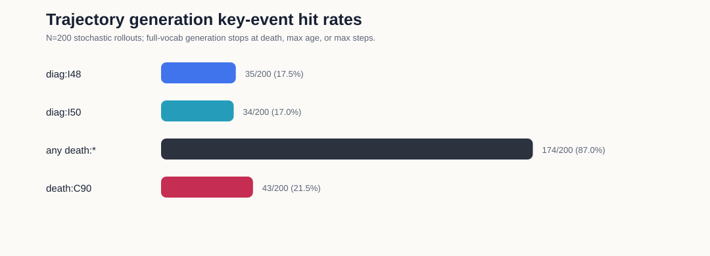
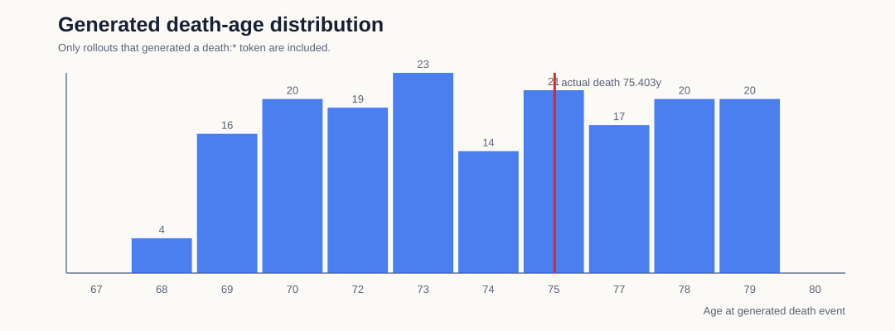
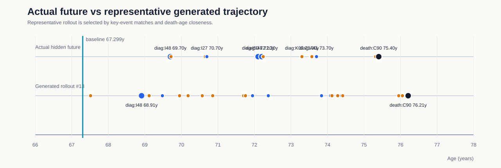

# 自回归轨迹生成 Demo: AF-GEN-001

## Demo 定位

该 demo 从同一个具体测试集患者的基线时点出发，让 Exp2 模型连续自回归生成后续事件轨迹。每生成一个 token，就把该 token 和生成年龄追加回输入，再预测下一步。

这与前一个 baseline ranking demo 不同：这里不是一次 forward 同时解释多个未来事件，而是多步 rollout。结果具有随机性，因此用多次 rollout 的命中率和分布展示，不把单条轨迹解释为确定性临床预测。

## 生成设置

| 项目 | 内容 |
|---|---|
| 模型 | Exp2 |
| 数据 split | test |
| split_patient_index | 2028 |
| 患者 ID | 已脱敏，不展示原始 eid |
| 基线年龄 | 67.299 岁 |
| 生成范围 | full |
| rollout 次数 | 200 |
| 最大生成步数 | 40 |
| 最大年龄 | 80.000 岁 |
| 是否禁止重复 token | 是 |
| 随机种子 | 20260525 |

## 真实隐藏未来

| 年龄 | token | 类型 |
|---:|---|---|
| 69.700 | `diag:I48` | 诊断 |
| 69.717 | `proc:X501` | 手术/操作 |
| 70.656 | `proc:K631` | 手术/操作 |
| 70.700 | `diag:I27` | 诊断 |
| 72.071 | `proc:U201` | 手术/操作 |
| 72.101 | `diag:I50` | 诊断 |
| 72.200 | `diag:I48` | 诊断 |
| 72.241 | `proc:K623` | 手术/操作 |
| 73.300 | `diag:K02` | 诊断 |
| 73.300 | `proc:F168` | 手术/操作 |
| 73.555 | `proc:X715` | 手术/操作 |
| 73.574 | `proc:X724` | 手术/操作 |
| 73.676 | `proc:X903` | 手术/操作 |
| 73.687 | `proc:S132` | 手术/操作 |
| 73.700 | `diag:A41` | 诊断 |
| 75.318 | `proc:U051` | 手术/操作 |
| 75.403 | `death:C90` | 死亡登记 |

## 关键事件生成命中

| 事件 | 命中次数 | 命中率 | 真实年龄 | 生成年龄均值 |
|---|---:|---:|---:|---:|
| `diag:I48` | 35 / 200 | 17.5% | 69.700 |  |
| `diag:I50` | 34 / 200 | 17.0% | 72.101 |  |
| 任意 `death:*` | 174 / 200 | 87.0% | 75.403 | 74.047 |
| `death:C90` | 43 / 200 | 21.5% | 75.403 | 72.449 |

## 可视化

## 代表性生成轨迹

代表性 rollout：`#13`。选择规则是优先匹配真实死亡 token，并尽量接近真实死亡年龄；房颤和心衰通过上方命中率统计展示。

| 步数 | 年龄 | token | 类型 |
|---:|---:|---|---|
| 1 | 67.515 | `proc:L742` | 手术/操作 |
| 2 | 68.851 | `proc:U201` | 手术/操作 |
| 3 | 68.911 | `diag:I48` | 诊断 |
| 4 | 69.119 | `proc:U297` | 手术/操作 |
| 5 | 69.481 | `diag:A41` | 诊断 |
| 6 | 69.951 | `proc:X403` | 手术/操作 |
| 7 | 70.185 | `proc:L997` | 手术/操作 |
| 8 | 70.573 | `proc:X705` | 手术/操作 |
| 9 | 70.858 | `proc:L914` | 手术/操作 |
| 10 | 71.704 | `proc:X361` | 手术/操作 |
| 11 | 71.754 | `proc:X363` | 手术/操作 |
| 12 | 71.948 | `diag:N17` | 诊断 |
| 13 | 72.381 | `diag:A09` | 诊断 |
| 14 | 73.837 | `diag:N39` | 诊断 |
| 15 | 74.086 | `diag:L98` | 诊断 |
| 16 | 74.123 | `proc:Q171` | 手术/操作 |
| 17 | 74.281 | `proc:W371` | 手术/操作 |
| 18 | 74.386 | `diag:C93` | 诊断 |
| 19 | 74.417 | `proc:X332` | 手术/操作 |
| 20 | 75.952 | `proc:L942` | 手术/操作 |
| 21 | 76.052 | `proc:G451` | 手术/操作 |
| 22 | 76.209 | `death:C90` | 死亡登记 |

## 汇报口径

该患者真实未来出现 `diag:I48`、`diag:I50`，并在 75.403 岁记录 `death:C90`。在 200 次自回归生成中，`diag:I48` 命中 35 次，`diag:I50` 命中 34 次，任意死亡 token 命中 174 次，精确死亡 token `death:C90` 命中 43 次。

因此，该 demo 可以作为“具体患者未来轨迹生成”的展示材料；但它仍是随机生成实验，不应表述为确定性预测或临床概率。

## 输出文件

- `AF-GEN-001_demo.json`：完整 JSON，包括每条 rollout 的生成序列。
- `AF-GEN-001_rollouts.csv`：每条 rollout 的命中摘要表。
- `AF-GEN-001_demo.md`：当前汇报说明。
